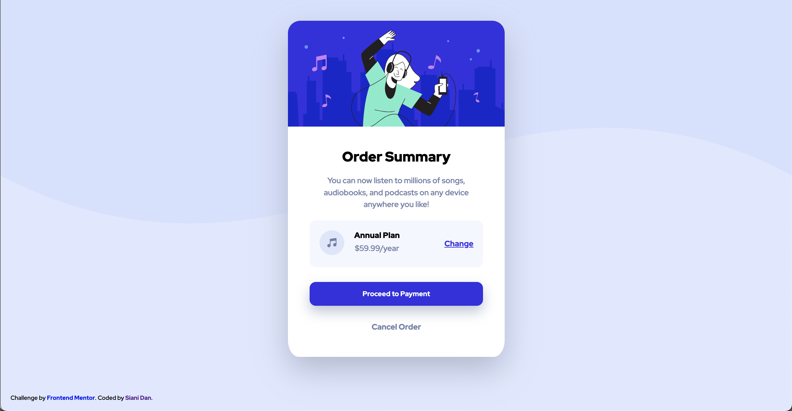

# Frontend Mentor - Order summary card solution

This is a solution to the [Order summary card challenge on Frontend Mentor](https://www.frontendmentor.io/challenges/order-summary-component-QlPmajDUj). Frontend Mentor challenges help you improve your coding skills by building realistic projects. 

## Table of contents

- [Overview](#overview)
  - [The challenge](#the-challenge)
  - [Screenshot](#screenshot)
  - [Links](#links)
- [My process](#my-process)
  - [What I learned](#what-i-learned)
  - [Useful resources](#useful-resources)
- [Author](#author)

## Overview

### The challenge

Users should be able to:

- See hover states for interactive elements

### Screenshot

### Links

- Solution URL: [Add solution URL here](https://your-solution-url.com)
- Live Site URL: [Add live site URL here](https://your-live-site-url.com)

## My process

### What I learned

  This is the first project I've completed using svg image files, and it was a good learning experience to figure out the ways in which they can be inserted into the code. I had a bit of a roadblock in the beginning when I couldn't get the svg background image to show up in Chrome, but it turned out to be a syntax error.

  I also got more practice with flexbox and when to use the different properties & values based on the page's design. I could definitely work on cleaning up/compacting my code, but I tried my best not to be redundant. Overall, I would say this challenge was a great way to brush up on my previous HTML & CSS knowledge, and I'm pretty pleased with the outcome.

### Useful resources

- [Using SVGs in CSS](https://www.freecodecamp.org/news/use-svg-images-in-css-html/) - This was my favorite resource when figuring out how to use SVG files in my code.
- [Box-shadow property](https://developer.mozilla.org/en-US/docs/Web/CSS/box-shadow) - This was used more as a refresher, but was still extremely helpful when styling my site.

## Author

- Website - [Siani Dan](https://github.com/sianidan)
- Frontend Mentor - [@sianidan](https://www.frontendmentor.io/profile/sianidan)
- Twitter - [@devbysiani](https://twitter.com/devbysiani)